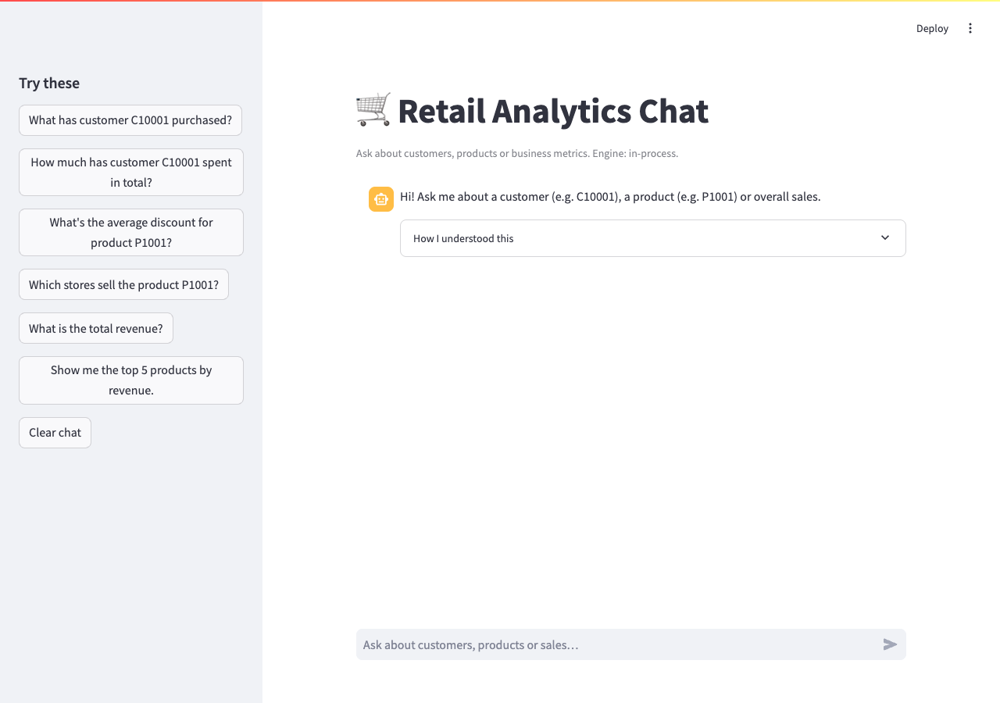
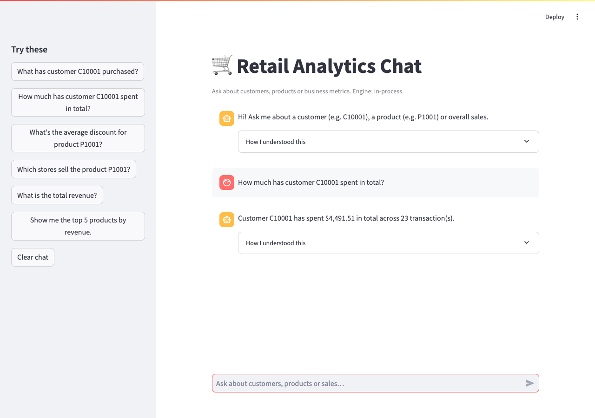
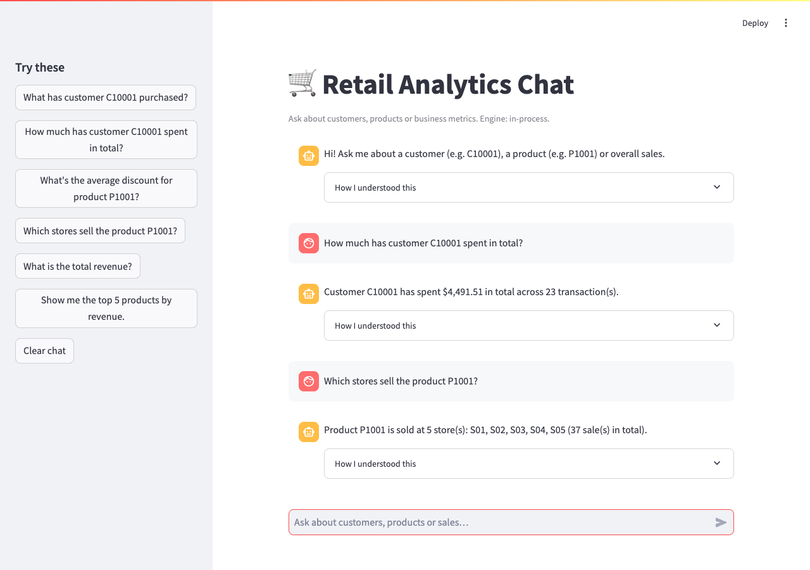
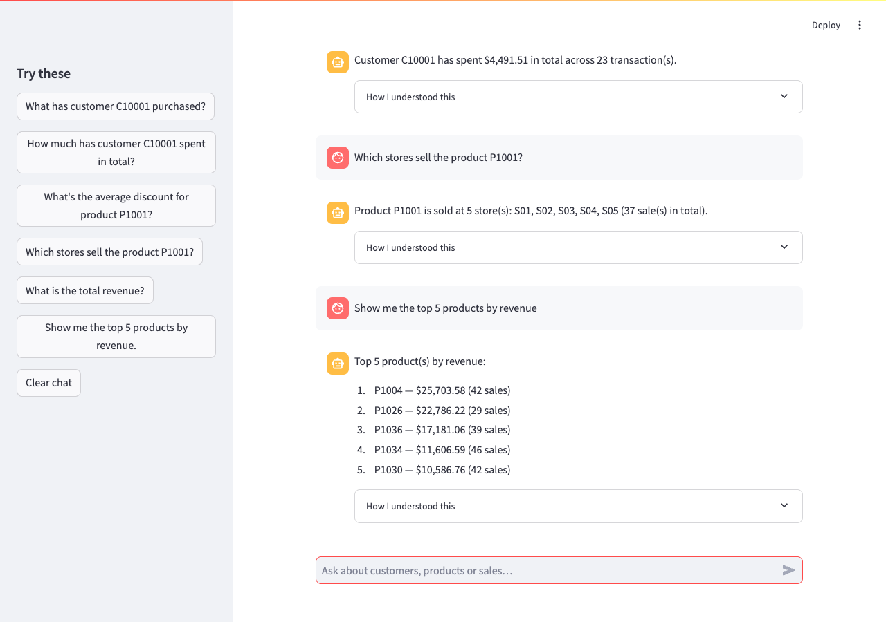

# Retail Data Analytics Chat System

An AI-powered retail analytics system: ask questions in plain English about
customers, products and business metrics, and get answers grounded in the
[Kaggle Retail Transaction Dataset](https://www.kaggle.com/datasets/fahadrehman07/retail-transaction-dataset/data).

```
You:  How much has customer C10001 spent in total?
Bot:  Customer C10001 has spent $4,491.51 in total across 23 transaction(s).

You:  Which stores sell the product P1001?
Bot:  Product P1001 is sold at 5 store(s): S01, S02, S03, S04, S05 (37 sale(s) in total).

You:  What is the total revenue?
Bot:  Business overview: $215,761.46 revenue across 1500 transaction(s) ...
```

## How it works

```
user message
    │
    ▼
intent classifier + entity extraction (src/retail_chat/intent.py)
    │  customer_history | customer_total | customer_product |
    │  product_discount | product_stores | product_summary |
    │  business_overview | top_products | top_customers | store_metrics
    ▼
data access layer (src/retail_chat/repository.py → SQLite)
    ▼
response generation (src/retail_chat/llm.py)
    template (offline default) · OpenAI · Anthropic · Ollama
    ▼
chat UI (Streamlit) or REST API (FastAPI)
```

Intent routing is deterministic and offline; the LLM layer only turns
already-retrieved database facts into prose (with automatic fallback to the
built-in template renderer if the LLM call fails).

## Setup (local run)

Prerequisites: Python 3.10+.

```bash
cd retail-chat
python3 -m venv .venv
source .venv/bin/activate
pip install -e ".[test]"
```

First run creates and seeds the database automatically (1500 deterministic
synthetic transactions, so the app and tests work with no download):

```bash
# Terminal 1 — API server
source .venv/bin/activate
uvicorn retail_chat.api:app --reload --port 8000

# Terminal 2 — chat UI
source .venv/bin/activate
streamlit run ui/app.py
```

Open http://localhost:8501 for the chat UI.
API docs are at http://localhost:8000/docs.

To point the UI at the API server instead of its in-process engine:

```bash
BACKEND_URL=http://localhost:8000 streamlit run ui/app.py
```

Run the tests:

```bash
python -m pytest tests/ -q
```

## Dataset download / setup

**Option A — real Kaggle data (recommended for the demo).**
The loader accepts any CSV whose headers look like customer / product / store
/ quantity / price / discount / total / date columns (see
`COLUMN_ALIASES` in `src/retail_chat/data_loader.py` for the full mapping),
so schema variations are handled automatically.

1. Download the CSV from
   https://www.kaggle.com/datasets/fahadrehman07/retail-transaction-dataset/data
   (or via the API helper below) and put it in `data/`.
2. Delete the seed database if one exists, then reload:

```bash
pip install kaggle            # only needed for the API helper
python -m retail_chat.data_loader --kaggle     # downloads + loads, or:
python -m retail_chat.data_loader --csv data/your-file.csv
rm -f data/retail.db && python -m retail_chat.data_loader
```

Alternatively set `DATA_CSV=/path/to/file.csv` in your `.env`.

**Option B — seed data (default).** If no CSV is found in `data/`, the app
generates `data/seed_transactions.csv` (deterministic: 60 customers
`C10001…`, 40 products `P1001…`, 5 stores `S01…`, all of 2024) and loads it.
The tests also build their own isolated databases from this generator, so
they never touch your real data.

## Environment variables

Copy `.env.example` to `.env`. Everything works with the defaults (no keys).

| Variable | Purpose | Default |
|---|---|---|
| `LLM_PROVIDER` | `template` \| `openai` \| `anthropic` \| `ollama` | `template` |
| `OPENAI_API_KEY` / `OPENAI_MODEL` | ChatGPT answers | — / `gpt-4o-mini` |
| `ANTHROPIC_API_KEY` / `ANTHROPIC_MODEL` | Claude answers | — / `claude-sonnet-4-…` |
| `OLLAMA_BASE_URL` / `OLLAMA_MODEL` | Local model answers | `http://localhost:11434` / `llama3.1` |
| `DATABASE_PATH` | SQLite file | `data/retail.db` |
| `DATA_CSV` | CSV to load instead of seed data | — |
| `KAGGLE_DATASET` | Slug for `--kaggle` download | `fahadrehman07/retail-transaction-dataset` |
| `BACKEND_URL` | UI → API server routing | — (in-process) |

Any LLM failure (missing key, server down) falls back to template answers,
so a query never fails because of the LLM.

## Example queries

Customer-specific:

- `What has customer C10001 purchased?`
- `How much has customer C10001 spent in total?`
- `Did customer C10001 buy product P1001?`

Product-specific:

- `What's the average discount for product P1001?`
- `Which stores sell the product P1001?`
- `Tell me about product P1004`

Business intelligence (stretch):

- `What is the total revenue?`
- `Show me the top 5 products by revenue`
- `Top 10 customers by spending`
- `Revenue by store`
- `Sales in the last 30 days` / `Revenue in March 2024` (time windows work
  on any query type, e.g. `How much did customer C10001 spend last month?`)

Edge cases handled: unknown IDs (`C99999`), missing IDs (“How much has the
customer spent?” asks for an ID), empty time windows, empty/unclear input.

## REST API

| Method | Endpoint | Purpose |
|---|---|---|
| `GET` | `/api/health` | status + active provider |
| `GET` | `/api/customers/{id}` | purchase history + totals |
| `GET` | `/api/customers/{id}/total` | total spent |
| `GET` | `/api/products/{id}` | sales stats, avg discount, stores |
| `GET` | `/api/products/{id}/stores` | stores carrying the product |
| `GET` | `/api/metrics/overview` | revenue, counts, avg basket |
| `GET` | `/api/metrics/top-products?n=5` | top products by revenue |
| `GET` | `/api/metrics/top-customers?n=5` | top customers by spending |
| `GET` | `/api/metrics/by-store` | revenue by store + category |
| `POST` | `/api/chat` | `{"message": "..."}` → full pipeline |

All endpoints accept an optional `?since=YYYY-MM-DD` filter.

## Project layout

```
retail-chat/
  src/retail_chat/   config, db, seed, data_loader, repository,
                     intent, llm, service, api
  ui/app.py          Streamlit chat UI
  tests/             pytest suite (unit + end-to-end)
  data/              CSV + SQLite live here (gitignored)
```

## Screenshots

The chat UI running locally against the seed database (every answer shows
its parsed intent and entities in the “How I understood this” expander):



*Customer query* — `How much has customer C10001 spent in total?`:



*Product query* — `Which stores sell the product P1001?`:



*Business query* — `Show me the top 5 products by revenue`:


